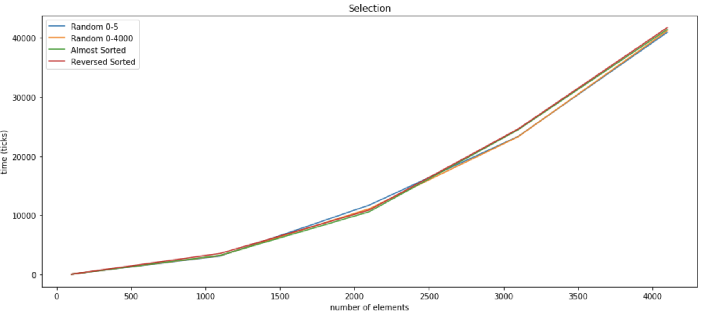

# Соколовский Вацлав, БПИ191
## Исследование времени работы алгоритмов сортировки

В [данной папке](https://github.com/RinokuS/SortingAlgorithms/SAComparison) представлены исходники исследовательского проекта на языке C++ и python-скрипт для генерации графиков. Все графики также сохранены в формате .png в [SACompariso/Charts](https://github.com/RinokuS/SortingAlgorithms/tree/main/SAComparison/Charts)

## Цель работы
Экспериментальное определение временной сложности сортировок различных массивов различными методами и сравнительный анализ полученных результатов.

## Постановка задачи
Измерить время выполнения алгоритмов сортировки:
1. Bubble sort
2. Insertion sort
3. Selection sort
4. Counting sort
5. Radix sort
6. Merge sort
7. Quick sort
8. Heap sort

Измерения провести для 4 видов массивов:
1. Массив, заполненный случайными значениями от 0 до 5
2. Массив, заполненный случайными значениями от 0 до 4000
3. Почти полностью отсортированный в правильном порядке массив
4. Отсортированный в обратном порядке массив

Также все измерения провести в двух диапазонах размерностей:
1. 50-300 с шагом в 50
2. 100-4100 с шагом в 1000

Все измерения записать в два .csv файла, разделенных по диапазонам размерностей. Из них составить две excel таблицы с данными и сгенерировать графики.

Всего должно быть проведено 352 сортировки, не учитывая кратности.

## Функционал
Для удобства выполнения и повторения эксперимента были реализованы:
1. Четыре функции для генерации массивов четырех необходимых типов по заданной необходимой размерности ([data_creator.h](https://github.com/RinokuS/SortingAlgorithms/blob/main/SAComparison/data_creator.h))
2. Функция проверки отсортированности массива после завершения работы алгоритма 
3. Функция вывода массивов в текстовые файлы для удобства проверки
4. Скрипт для генерации графиков с помощью pandas и matplotlib ([charts.ipynb](https://github.com/RinokuS/SortingAlgorithms/blob/main/SAComparison/charts.ipynb))

## Отчет
Результатом проведения исследовательской работы являются 24 графика.

По графикам мы прерасно видим, что Counting и Radix сортировки прекрасно оправдывают свое звание псевдолинейных на целочисленных массивах и проходят максимально близко к оси Х по сравнению с другими алгоритмами.

Смотря на графики квадратичных сортировок мы можем видеть, что пузырьковая сортировка и правда выдает худшее время практически на всех вариантах входных данных.  
Также важно заметить, что Сортировка слиянием включена в группу квадратичных по той причине, что на малых данных работает крайне медленно и схожа с квадратичными, но уже ближе к размеру массива 3000+ алгоритм сортировки слиянием оправдывает свою принадлежность группе nlogn и растет сильно медленнее всех квадратичных.

P.S. Интересное дополнительное наблюдение:  
Сортировка выбором на всех видах массивов ведет себя практически полностью идентично, что совершенно не похоже на другие виды сортировок.

